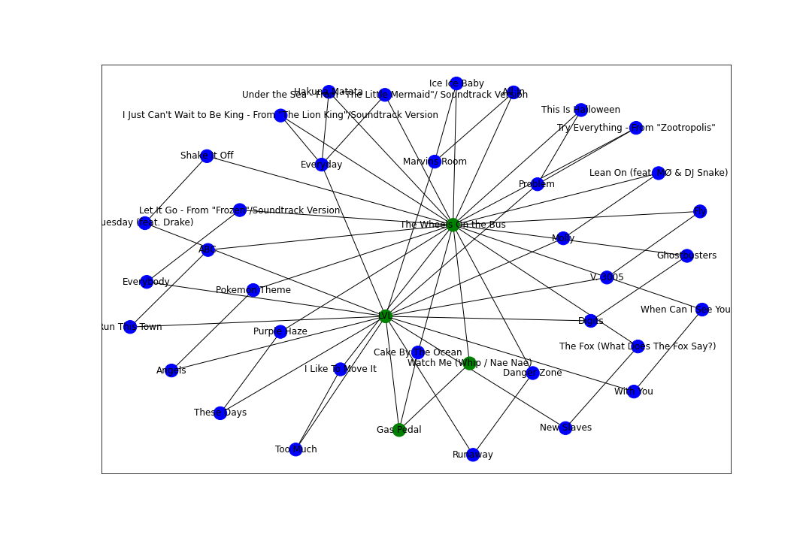

# Spotify Genre Bridge
**Author:** Christopher Varghese

## Business Problem
Spotify is in the top tier of music streaming services. With over 100 million listeners, Spotify is always improving their platform to best serve their users. One of the main features of Spotify is their music reccomendation service. The provision of tailored picks ensures that users continue to stream music on their platform, and also benefits creators. Spotify's current algorithm reccomends songs that are similar in grouping and genre to the general pool of music that the user listens to. This model helps to improve their existing algorithm by providing a solution for providing song reccomendations from samples that are greatly differing in genre. Since a main function of music reccomendations are to constantly engage users, providing suggestions that bridge distinct genres that a user is fond of will likely provide the user with fresh music that appeals to their taste in both genres. Providing fresh music that is interesting to the user is a unique way to engage them beyond providing songs that adhere to a single genre that the user listens to, which may not be new music to the user. 

## Overview
This project finds paths between songs that are in different genres using playlist data which is user generated. In this project I will discuss:
- Data Acquistion and Treatment
- Visualization of the Data and Modelling Process
- Model Implementation
- Further Exploration

## Data Understanding
The data was retrieved from Spotify's Million Playlist Dataset Challenge. This dataset contains exactly 1 Million Playlist which were sampled from over 4 Billion playlists that exist on Spotify's Platform. This Dataset contains over 2 Million unique tracks by almost 300,000 artists. For the purposes of this model, I will be representing this data as an undirected weighted graph. In the graph, a node will be a single song and an edge will represent if two songs appear in a playlist together. The weight of each edge will denote the number of playlists the two songs appear in together. Here is an in-depth explanation on the graph data structure. https://www.geeksforgeeks.org/graph-data-structure-and-algorithms/

Since this dataset was generated by experts for the purpose of a competition, citing the creators is necessary. I have attached the citation here.

Spotify, Ching-Wei Chen, et al. “Recsys Challenge 2018: Automatic Music Playlist Continuation.” Recsys Challenge 2018 | Proceedings of the 12th ACM Conference on Recommender Systems, 1 Sept. 2018, dl.acm.org/doi/abs/10.1145/3240323.3240342. 

### Visualization of Data
The MPD is divided into 1,000 json files that each contain 1,000 playlists. In order to simply showcase and visualize the graph and search algorithms, 1,000 playlists is an adequate and managable sample. Since the graph and search algorithms are easily scalable in this implementation, utilizing 1,000,000 playlists will be simple to implement later. Additionally, these 1,000 playlists contain 29,005 unique tracks.

This visual shows the distribution for the frequencies of songs as they appear in the 1,000 playlists. The vast majority of songs only appear a single time in this data set. Alternatively, this distribution is heavily skewed to the right as there are even a minute amount of songs appearing more than 50 times. This means that the playlists are very connected, but they still contain enough sparse songs to provide new and valuable reccomendations with.

### Modelling Process
Above is the json structure for the first five playlists in the data set. I will be representing the graph using an adjency list. This will be a dictionary where a key is a track and the value is a list of tuples containing connected songs and their corrosponding edge weights. An in depth explanation of graph representation and specifically adjency lists can be found here. https://www.geeksforgeeks.org/graph-and-its-representations/

This is a visual representation of the graph structure. Of course, this is only a small sample of songs and it is already very cluttered since each song has an edge with every song that it is in a playlist with.

Now that the graph is created and we have a list of all the songs that appear in these 1,000 playlists, we can begin implementing the model. For the first iteration of my model, I will be using a Breadth-First search. Out of the two basic search algorithms, DFS(Depth-First search) and BFS, I chose BFS for multiple reasons. First, BFS will yield the shortest distance between two nodes in a graph whereas DFS does not guarantee its output is the shortest path. Secondly, since this is such a well-connected and expansive graph, the runtime of searching children before neighboring nodes(DFS) will have a much higher runtime than starting at one point and searching all neighboring nodes first(BFS). The output of the BFS search will be a path of nodes from one song to another. The outputted path will likely contain songs that are relevant to both starting and ending songs since the path is a bridge between the two songs. This iteration of the model properly searches the graph but does not take advantage of the edge weights. A detailed explanation on BFS can be found here. https://www.geeksforgeeks.org/breadth-first-search-or-bfs-for-a-graph/

### Testing
For testing the various models, I started at the song 'LVL' and traversed to songs that were a direct neighbor, somewhat related, and a totally different genre. For the final model, I used the song "The Wheels On the Bus" as the destination from the song "LVL" by A$AP. My model was able to find all of the shortest possible paths between these songs and generate a reccomended playlist that fuses the two genres. 

'Everybody', 'LVL', 'Watch Me (Whip / Nae Nae)', 'I Just Can\'t Wait to Be King - From "The Lion King"/Soundtrack Version', 'Molly', 'Purple Haze', 'Under the Sea - From "The Little Mermaid"/ Soundtrack Version', 'The Wheels On the Bus', 'Ghostbusters', 'Let It Go - From "Frozen"/Soundtrack Version', 'This Is Halloween', 'Problem', 'Run This Town', 'Tuesday (feat. Drake)', 'Gas Pedal', 'Angels', 'New Slaves', 'Fly', 'All In', 'Runaway', 'Too Much', 'Digits', 'Danger Zone', 'Pokemon Theme', 'These Days', 'Lean On (feat. MØ & DJ Snake)', 'Everyday', 'Shake It Off', 'The Fox (What Does The Fox Say?)', 'When Can I See You Again?', 'ABC', 'V. 3005', 'Marvins Room', 'I Like To Move It', 'With You', 'Cake By The Ocean', 'Try Everything - From "Zootropolis"', 'Hakuna Matata', 'Ice Ice Baby'

The program was also able to execute in 868 seconds which is quite fast given my current environment relative to previous testing.

## Conclusion and Next Steps
The current final model is performing very well. It is able to accurately retrieve a list of relevant songs that bridges the differing genres of two songs. The clear next step is further testing of this model with the entirety of the MPD so that I can ensure that this model is working perfectly as intended. Once I am able to confirm that the BFS is working with 100% accuracy, I can use that algorithm to test further iterations of this model. Beyond this, I have a few more iterations that can be implemented easily based on the current performance of the model and will improve and bring new information. The first is to use an iteratively deeping DFS. This algorithm may be faster than the BFS since it is a hybrid of the BFS and DFS search algorithms. Another key element to add is the functionality to take multiple songs as an input. This would either require a 'greedy' search which will find a path through all the inputted songs quickly, or a comprehensive A* search that finds the exact shortest path.

While this model is extremely relevant to a service like spotify, and can provide a new angle for their song reccomendation algorithm, this has further applications in the music streaming realm and other business uses. Firstly, this algorithm which utilizes the connectedness of playlists to generate a list of reccomended songs can be used for group playlist creation. For example, a school may be trying to put together a playlist for their homecoming dance. This model can be tweaked to perform a most-connectedness search to give a playlist that takes into account all of the playlists submitted by students. Rather than simply tally up the most frequented songs and dump them into a playlist, this algorithm would ensure that majority of the students are actually contributing the group playlist while still containing the most popular songs overall. This model also has applications in social media networks, itemized transactions, route optimization and so forth. 

Contact me at

**Email:** chrisvarghese2000@gmail.com

**Phone:** 312-823-5252
